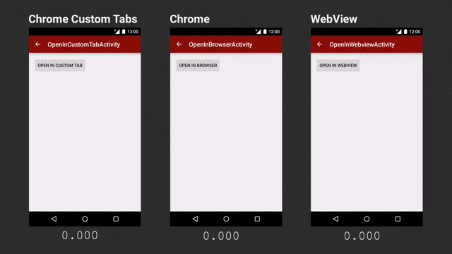

# CustomTabsHelper

Custom tabs, made easy.

## Why custom tabs?

> Chrome Custom Tabs provides a way for an application to customize and interact with a Chrome Activity on Android. This makes the web content feel like being a part of the application, while retaining the full functionality and performance of a complete web browser.
>
> ——[GoogleChrome/custom-tabs-client](https://github.com/GoogleChrome/custom-tabs-client)



[Chrome custom tabs smooth the transition between apps and the web - Android Developers Blog](http://android-developers.blogspot.com/2015/09/chrome-custom-tabs-smooth-transition.html)

[Google documentation on using custom tabs](https://github.com/GoogleChrome/custom-tabs-client/blob/master/Using.md)

## Why this library?

Apart from the [custom tabs support library](http://developer.android.com/tools/support-library/features.html#custom-tabs), Google has also published a detailed sample ([GoogleChrome/custom-tabs-client](https://github.com/GoogleChrome/custom-tabs-client)) for reference.

The Google sample included a [CustomTabActivityHelper](https://github.com/GoogleChrome/custom-tabs-client/blob/master/demos/src/main/java/org/chromium/customtabsdemos/CustomTabActivityHelper.java) and some other utilities, which can be of great convenience for developers. However, manually integrating them is still tedious.

This library packaged those utility classes and service declaration for easy integration. Furthermore, a `CustomTabsHelperFragment` is added for managing the `CustomTabActivityHelper` with your activity life cycle automatically. Now you can enjoy the warm up boost within lines of code.

[Sample APK](//github.com/zhanghai/CustomTabsHelper/releases/download/v1.0.6/sample-release.apk)

## Integration

Gradle:

```gradle
compile 'me.zhanghai.android.customtabshelper:library:1.0.6'
```

## Usage

To attach a [CustomTabsHelperFragment](library/src/main/java/me/zhanghai/android/customtabshelper/CustomTabsHelperFragment.java) to an activity:

```java
private CustomTabsHelperFragment mCustomTabsHelperFragment;
...
@Override
protected void onCreate(Bundle savedInstanceState) {
    ...
    mCustomTabsHelperFragment = CustomTabsHelperFragment.attachTo(this);
    ...
}
```

Calling `attachTo()` for a fragment also works fine because the `CustomTabsHelperFragment` is always attached to the host activity. So in this way, you can call `attachTo()` whenever your fragment or activity itself needs to use custom tabs, thus managing custom tabs usage independently.

To hint for a likely URL:

```java
mCustomTabsHelperFragment.mayLaunchUrl(YOUR_URI, null, null);
```

But it is likely that you need to wrap this call in a `CustomTabsActivityHelper.ConnectionCallback` just as [in the sample app](sample/src/main/java/me/zhanghai/android/customtabshelper/sample/MainActivity.java).

To open a URL with custom tabs:

```java
CustomTabsHelperFragment.open(this, mCustomTabsIntent, YOUR_URI, yourFallback);
```

A more detailed sample is available in the sample app's [MainActivity](sample/src/main/java/me/zhanghai/android/customtabshelper/sample/MainActivity.java).

## License

    Copyright 2015 Zhang Hai

    Licensed under the Apache License, Version 2.0 (the "License");
    you may not use this file except in compliance with the License.
    You may obtain a copy of the License at

       http://www.apache.org/licenses/LICENSE-2.0

    Unless required by applicable law or agreed to in writing, software
    distributed under the License is distributed on an "AS IS" BASIS,
    WITHOUT WARRANTIES OR CONDITIONS OF ANY KIND, either express or implied.
    See the License for the specific language governing permissions and
    limitations under the License.
